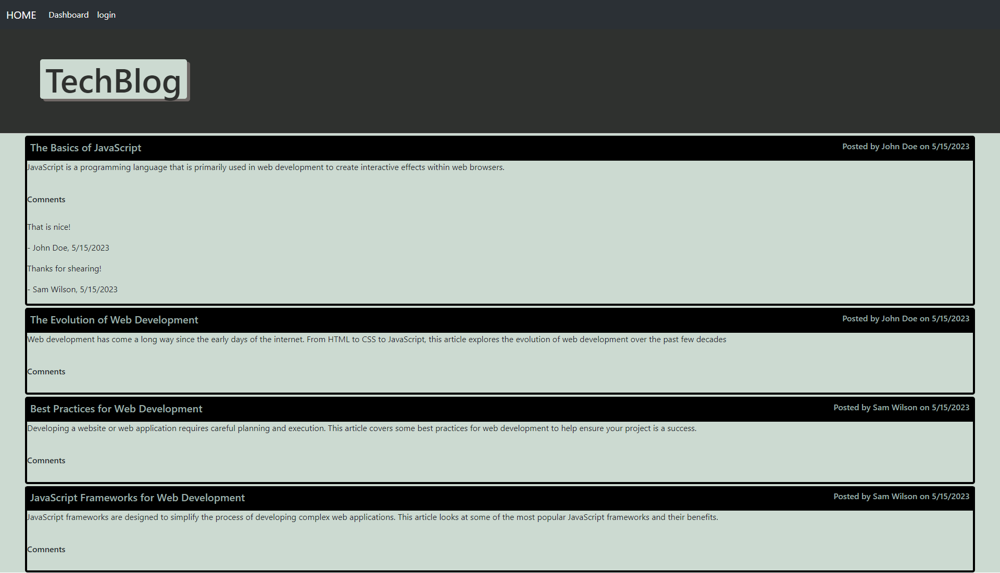

# TechBlog

## Table of Contents
- [Description](#description)
- [Usage](#usage)
- [Credits](#credits)
- [License](#license)

## Description

TechBlog is a project aimed at developing a technology blog website. The website allows users to sign up and read posted blogs on the home page without the need to log in. Logged-in users have additional features such as the ability to add, edit, and delete their own blogs in the profile page. They can also comment on other users' blogs. All blogs, comments, and user information are stored in a database.This site has been built besed on user story provided by UW cooding bootcamp for chalange 14. The full content of the user story can be found git hub issue 1 of this repository.

## Usage

To access the application, visit [this link](https://tech-blog-web.herokuapp.com/). Upon opening the URL, you will be presented with the home page displaying multiple blog cards along with their comments. The navigation bar contains links to the home, dashboard, and login pages. If no user is logged in, both the dashboard and login links will direct you to the sign-in page. A toggle button labeled "Sign Up Instead/Login Instead" can be used to switch between signing up and logging in.

Once a user signs up and logs in, they will be redirected to the profile page. In the profile page, users can create new blogs using the "Add New Blog" button. They can also update or delete existing blogs by clicking on the title of the blog to access the editing form. Logged-in users also have the ability to add comments on other people's blogs from the home page by clicking on the blog title to access the comment form.

For a detailed demonstration of the app's functionality, please refer to the following walkthrough video:

[Walkthrough Vedio](https://youtu.be/_2l86SzgsmU)

## Credits
I used resorces in UW bootcamp modules and mini-project examples.

## License
MIT License

Copyright (c) 2023 GET

Permission is hereby granted, free of charge, to any person obtaining a copy
of this software and associated documentation files (the "Software"), to deal
in the Software without restriction, including without limitation the rights
to use, copy, modify, merge, publish, distribute, sublicense, and/or sell
copies of the Software, and to permit persons to whom the Software is
furnished to do so, subject to the following conditions:

The above copyright notice and this permission notice shall be included in all
copies or substantial portions of the Software.

THE SOFTWARE IS PROVIDED "AS IS", WITHOUT WARRANTY OF ANY KIND, EXPRESS OR
IMPLIED, INCLUDING BUT NOT LIMITED TO THE WARRANTIES OF MERCHANTABILITY,
FITNESS FOR A PARTICULAR PURPOSE AND NONINFRINGEMENT. IN NO EVENT SHALL THE
AUTHORS OR COPYRIGHT HOLDERS BE LIABLE FOR ANY CLAIM, DAMAGES OR OTHER
LIABILITY, WHETHER IN AN ACTION OF CONTRACT, TORT OR OTHERWISE, ARISING FROM,
OUT OF OR IN CONNECTION WITH THE SOFTWARE OR THE USE OR OTHER DEALINGS IN THE
SOFTWARE.